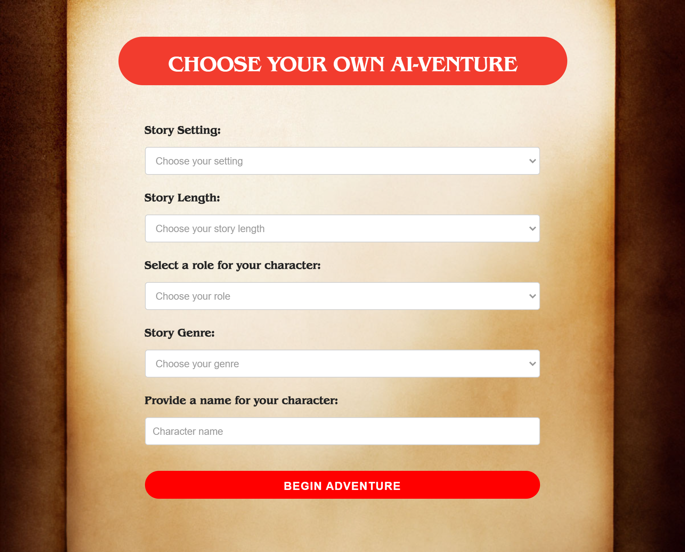

# Choose Your Own AI-venture 🌟

## Description 📖
Choose Your Own AI-venture is an interactive web-based storytelling application that integrates OpenAI's GPT and DALL-E models to create unique and dynamic stories based on user choices. Users can select their character's traits, the story's genre and setting, and guide the narrative through their decisions.

## Features 🚀
- **API Key Entry**: Users must enter an OpenAI API key to access the application.
- **User Preferences**: Users can customize their character and select the genre and setting for their adventure.
- **Dynamic Storytelling**: The story progresses based on user choices, offering a rich and varied narrative experience.
- **Image Generation**: Each story segment is accompanied by visually engaging images generated by DALL-E.

## Setup and Installation 💻
- **Local Setup**:
  1. Clone the repository to your local machine.
  2. Open the project in Visual Studio Code or your preferred IDE.
  3. Open the `index.html` file in a web browser to start using the application.
- **GitHub Pages**:
  - Alternatively, access the application directly through the provided GitHub Pages link.

## Obtaining an OpenAI API Key 🗝️
To use Choose Your Own AI-venture, you'll need an OpenAI API key. Here's how to get one:
1. Visit [OpenAI's API website](https://openai.com/blog/openai-api).
2. Sign up for an account if you don't already have one.
3. Once logged in, navigate to the API section.
4. You can subscribe to a free tier that offers limited usage. This is a great way to start and explore what the application can do!
5. After obtaining your API key, enter it into the application as prompted.

## Website Preview 🌐
Below are some screenshots of the application in action:

Experience the thrill of your personalized adventure directly in your browser. The website offers an intuitive and user-friendly interface for seamless interaction with the story. Simply enter your preferences, and let your journey unfold!

## Usage Instructions 📝
1. Enter your OpenAI API key when prompted on the home page.
2. Fill in your character details and choose your desired story settings.
3. Start your adventure and make choices that shape the story.
4. Enjoy the dynamically generated text and images as your story unfolds.

## License 📜
This project is licensed under the MIT License. See the [LICENSE](LICENSE) file for more details.

## Acknowledgments 👏
- Shoutout to friends and family who helped test and provide feedback.
- OpenAI for their GPT and DALL-E models.